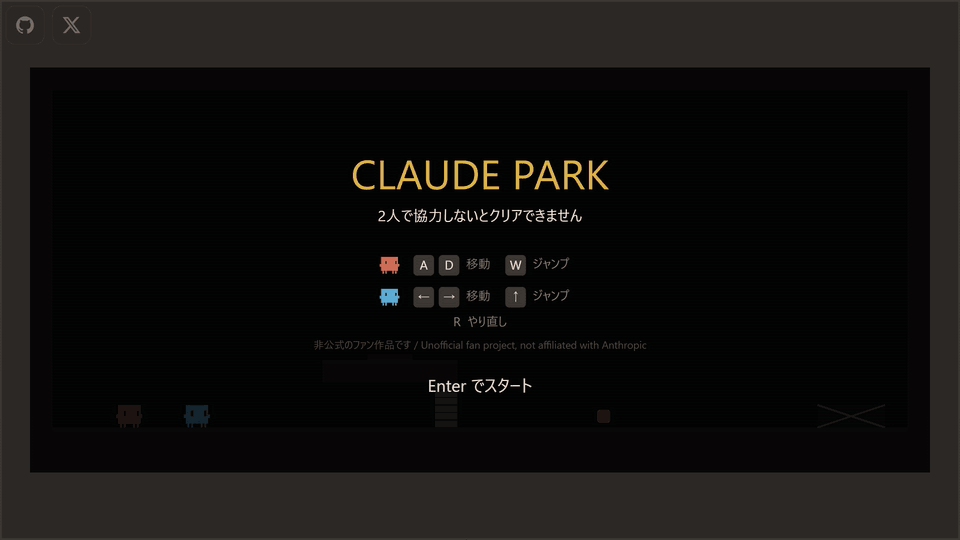

# Claude Park

[](https://rokkish.github.io/claude-park/)

**▶ [ブラウザで遊ぶ](https://rokkish.github.io/claude-park/)**
（[元動画 (mp4)](docs/claude-park-demo.mp4)）

Pico Park 風の、ブラウザで動くローカル協力アクションパズル。
**1台のキーボードを2人で共有して遊びます。**

> **非公式のファン作品です。**
> Anthropic とは一切関係がなく、同社に承認・後援されたものでもありません。
> キャラクターは Claude Code のマスコット "Clawd" を作画リファレンスにした
> 個人の非営利ファン作品です。関連する名称・意匠の権利は Anthropic に帰属します。
>
> *This is an unofficial, non-commercial fan project. Not affiliated with,
> endorsed by, or sponsored by Anthropic.*

## 遊び方

**2人用です。** 1台の端末を2人で共有して遊びます。

### PC

|  | 移動 | ジャンプ |
| --- | --- | --- |
| P1 | `A` / `D` | `W` または `Space` |
| P2 | `←` / `→` | `↑` |

起動するとワールド選択画面が出ます。`←` `→` で選び、`Enter` で決定します。
プレイ中は `R` でステージをやり直せます。

### スマートフォン・タブレット

画面下のボタンで操作します。左側が P1、右側が P2 で、ボタンの色がキャラの色と対応しています。
ワールド選択画面では `◀` `▶` で選び、`▲` で決定します（どちらのプレイヤーの操作でも動きます）。
**横向きを推奨**します（ステージが横長のため、縦向きだとゲーム画面がかなり小さくなります）。

URL バーを消したい場合:

- **Android / PC**: 右上の ⛶ ボタン、またはゲーム画面を最初にタップした時点で全画面になります。
- **iPhone**: Safari が Fullscreen API に対応していないため、共有メニューから
  **「ホーム画面に追加」**してください。PWA として起動すると URL バーなしの全画面になります。

ステージ1は**単独では絶対にクリアできない**設計です。単独ジャンプの到達高は約2.6タイルで、
道を塞ぐ3タイルの段差には届きません。相手の頭に乗ってから跳べば約3.6タイル届きます。
片方が感圧板を踏み続けている間だけ、もう片方が地上のゲートを通れます。

## 開発

```bash
npm install
npm run dev        # http://localhost:5173/
npm test           # 物理とステージ成立性のテスト
npm run build      # 型検査 + 本番ビルド
```

### 特定のステージから始める

動作確認用に、URL で開始ステージを指定できます。

```
?stage=1-2        ワールド1の2面から
?stage=stage-03   id 指定でも可
```

既知のステージに一致しない値は黙って先頭に落ちます。

### 見た目の確認

ヘッドレスブラウザが使えない環境向けに、実際の描画コードを走らせて PNG に焼くツールがあります。

```bash
npx vite-node scripts/preview-clawd.ts out.png              # キャラの各ポーズ
npx vite-node scripts/preview-stage.ts out.png 5 start       # out.png [stage] [pose]
```

## 設計

詳細は [docs/SPEC.md](docs/SPEC.md) を参照してください。要点だけ挙げると:

- **ギミック間はシグナルバスで疎結合。** 感圧板は `sw1` に書くだけ、ゲートは `sw1` を読むだけで
  互いを知らないため、スイッチや受信ギミックを足しても組み合わせが爆発しません。
- **ギミック追加は新規ファイル1つ + 登録1行。** エンジンにも他ギミックにも触りません。
- **ステージ追加は JSON 1つ。** 既存ギミックの組み合わせだけなら、コードは1行も書きません。
- **物理は Actor/Solid 分離。** プレイヤーは Actor であり、同時に他プレイヤーにとっては
  Solid（頭に乗れる）でもあります。

`src/game/tuning.ts` の `JUMP_VELOCITY` と `GRAVITY` はステージ設計と直結しています。
変更する場合は SPEC §7.5 の検算表と `tests/stage01.test.ts` を必ず併せて更新してください。

## リリース履歴

### v1.3.0 — 2026-07-26

高難易度ステージ **1-4「Two Keys」** を追加。全10ステージになりました。
操作数は既存ステージの約2倍、鍵は2つ、気づきが2つ必要です。

- **気づき①「橋を架ける役は渡れない」** — 板αが谷に橋を架けるが、先へ進む扉は
  α と対岸の β の同時押しを要求する。橋を保持している本人は渡れない
- **気づき②「入口と出口が逆位相」** — 鍵2の部屋は、入口が「誰も踏んでいないとき」、
  出口が「踏んでいる間だけ」開く。入った側は自力で出られない

高さによる制限は一切使っていません。相方の頭の上で跳ぶ二段ジャンプが地面から
149px 届くため、跳躍力を前提にした設計は破られます（3-2 / 3-3 で2度経験）。
このステージは要求の構造だけで縛っています。

### v1.2.0 — 2026-07-26

World 3（キーアイデア: **運べる箱**）の3ステージを追加。全9ステージ・3ワールドになりました。
起動時に**ワールド選択画面**が出ます。

| | ステージ | 見せる面 |
| --- | --- | --- |
| 3-1 | Doorstop | 箱が「板に残る人」の代わりをする |
| 3-2 | Double Lock | 2つの錠。片方を箱が押さえ続けるので、人が2人とも塞がらずに済む |
| 3-3 | Relay | 箱を運ぶこと自体に協力が要る。押さえ続けられるのは箱だけ |

箱そのものはほとんどコードを持ちません。押し合いと「上に乗る」は、プレイヤー同士のために
書いた物理の経路がそのまま効いています。ギミックが Actor を物理世界に提供できるように
したのが今回の基盤変更です。

重なり通知をプレイヤー限定から一般化し、感圧板は重さしか見ない（誰でも踏める）、鍵は人限定、
という線引きにしました。これが「道具が人の代わりをする」を成立させています。

### v1.1.0 — 2026-07-26

World 2（キーアイデア: **動く足場**）の3ステージを追加。全6ステージになりました。

| | ステージ | 見せる面 |
| --- | --- | --- |
| 2-1 | Ferry | 相方が押している間だけ動く渡し船。両岸の板で送り合う |
| 2-2 | Counterweight | 1つの信号が2つの足場を**逆向き**に動かす |
| 2-3 | Tandem | 常時往復する足場でタイミング。渡った先はブーストで登る |

逆位相は専用の仕組みではなく、始点と終点を入れ替えるだけで実現しています。

**基盤の変更**

- 仕様書 §3.4 に書いてあったのに未実装だった「Solid が乗員を運ぶ」を実装。
  それまでは床を動かしてもプレイヤーをすり抜け、めり込んだ瞬間に圧殺していた
- 動く足場ギミック `platform` を追加。信号連動と常時往復の両対応
- レイアウトの寸法計算を CSS の `calc` から TypeScript へ移し、実在7端末を
  縦横で回すテストで固定（過去2回この層でリグレッションを出しているため）
- 操作説明が最初の入力で消えるようにした。画面中央を占め続けると
  ステージが縦方向を使えない
- `?stage=2-1` で任意のステージから開始できる（動作確認用）

### v1.0.0 — 2026-07-25

初回リリース。World 1 が完成し、3ステージを通しで遊べます。

Pico Park に倣い「1ワールド1キーアイデア」の構成を採っています。World 1 のキーアイデアは
**スイッチ（押している間だけ効く）** で、3面がそれぞれ別の面を見せます。

| | ステージ | 見せる面 |
| --- | --- | --- |
| 1-1 | Boost & Hold | 押し続ける — 保持と役割の非対称 |
| 1-2 | Both at Once | 同時に押す — 2枚の板を同時に踏む |
| 1-3 | Bridge | 押すと現れる — 反転スイッチと板の受け渡し |

1-2 と 1-3 は**新しいギミックのコードを1行も書かずに**追加しています。`gate` の `mode` と
`latch` は 1-1 では使っていなかった機能で、特に 1-3 の橋は `mode: "none"` の `gate` を
水平に置いただけです（`gate` は閉のとき Solid なので、反転させると「踏むと床が現れる」になる）。

**この版に含まれるもの**

- Actor/Solid 分離の自作物理。1px 刻みの移動でトンネリングを防ぎ、プレイヤーの頭の上に
  乗って一緒に運ばれる
- シグナルバスによるギミック間の疎結合（発信側と受信側が互いを知らない）
- Clawd のピクセルアート描画。スカッシュ＆ストレッチ、歩行、荷重時の表情
- キーボード（1台を2人で共有）とタッチの併用。縦横のレイアウト切り替え、全画面、PWA
- クリアタイムの計測（`00:00:00.000`）と、全ステージ踏破時の共有ボタン
- GitHub Actions によるデプロイ。テストと型検査を公開前のゲートにしている

**既知の制約**

- 縦画面では操作ボタンが収まらないため、幅 710px 未満の端末では横向きを促します
- 4面目の枠は空けたままです（キーアイデアが変わるため World 1 はここで完成としました）

## ライセンス

コードは MIT ライセンスです（[LICENSE](LICENSE)）。
ただしキャラクターの意匠および "Claude" / "Clawd" に関連する名称は
このライセンスの対象外で、Anthropic に帰属します。
